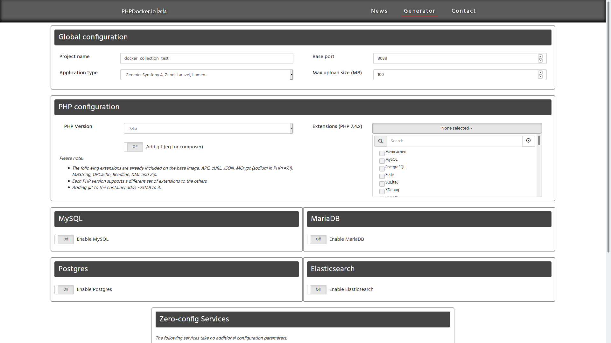

# Images Docker generator

**Written in 2021-05-23**

* [What is it?](#What-is-it)
* [Analysis](#Analysis)
* [How everything works](#How-everything-works)
* [Highlights](#Highlights)
* [General thoughts](#General-thoughts)



Check here: `https://phpdocker.io/generator`.

This is not exactly a Docker receipt, but a *generator* for dockers receipts.

## What is it?

The site provides a configuration bundle to choose some configurations:

* PHP version
* Extensions
* Some database. Multiples, versions and credentials for each one desired. If requires. Including Elasticsearch and Redis.

Then the site builds a simple zip file containing the docker-compose.yml file containing the services queried by site's panel and also some configuration files for php and webserver that will be mounted and will replaces the default services configuration file. For databases, no overwritten configuration file is provided, but you have the option to set databases credentials.

## Analysis

I will generate the most simple setup and analyses it.

```
├── docker-compose.yml
└── phpdocker
    ├── nginx
    │   └── nginx.conf
    ├── php-fpm
    │   ├── Dockerfile
    │   └── php-ini-overrides.ini
    ├── README.html
    └── README.md
```

Following down for minimum files that enables the environment, so facilitates the analysis (just ignoring READMES, not required to make the environment works):

```
├── docker-compose.yml
└── phpdocker
    ├── nginx
    │   └── nginx.conf
    ├── php-fpm
    │   ├── Dockerfile
    │   └── php-ini-overrides.ini
    └── public
        └── index.php
```
*Notice* that in this *minimun working* files tree I needed to add modifications adding a new folder and the `index.php` file inside. This is because the simplest docker receipt outputed by the site is not enough necessary to test a working *hello world* environment. If you check the main folder README, it also calls that you make a little further setup in the nginx.conf to fit to what you have locally.

The way as it was designed to works seems that is just to *pour* the docker project files into yout existing php project and them just executes the `docker-compose up -d --build` to have a php environment working with your project. Just pay attention to the location of the `index.php` file. By default, it is configured to work from `public/index.php`. You may have a different place from where your php application starts, so in this case look to the `nginx.conf` and change the *root project project folder* to the right place for your application. Them, stop the docker imagem and them restart to reload the configuration.

## How everything works

The receipts borrows from its two services an webservice service from `nginx:alpine` and the php service from `phpdocker/php-fpm`. Both seems to be *naturally connected*.

They are builded together with the `docker-compose up -d --build`, the two docker images are up and working together, one to serve the webserver and another the PHP.

## Highlights

* **Nginx instead of the Apache**. Not a big deal, but must be taken account on this, if some webserver configuration is need, as the Nginx and Apache syntax for their configuration file differs completely.

* **docker-compose.yml** haves two services: a *werbserver* and *php-fpm*. It seems that the php itself and the webserver are running in different service.

Note also that if you want to log into the images, you will have different interpreters. For example, to log into `php-fpm`, you can use **`bash`**, meanwhile if you disires to log into the webservice, you do not have `bash` available. Instead, you may use **`sh`** interpreter.

## General thoughts

This is a direct way to have an lamp environment. But i think that is kinda weird to have php and webserver running in differents services.

May the container from webserver is a more humble one, as the `nginx:alpine` repository, used to provides the webserver, does not have shipped the bash interpreter.
